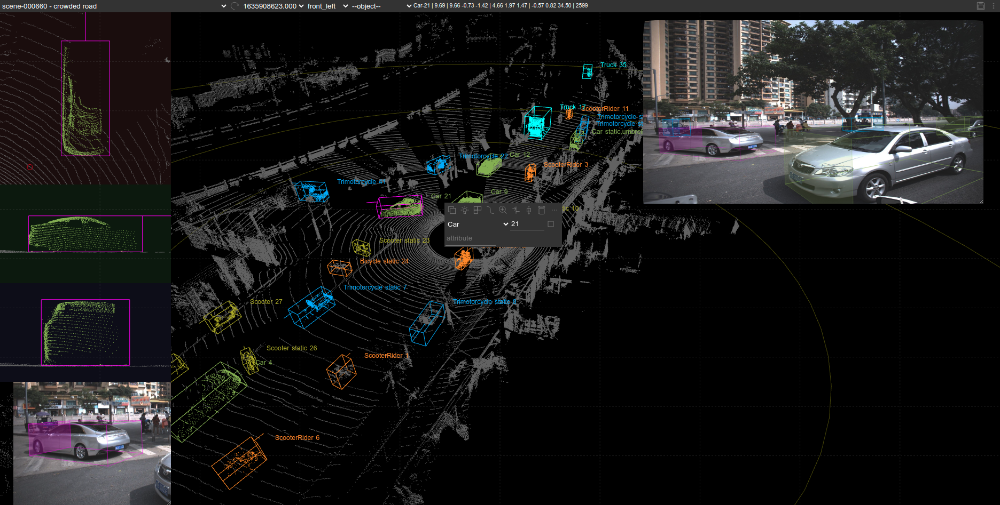
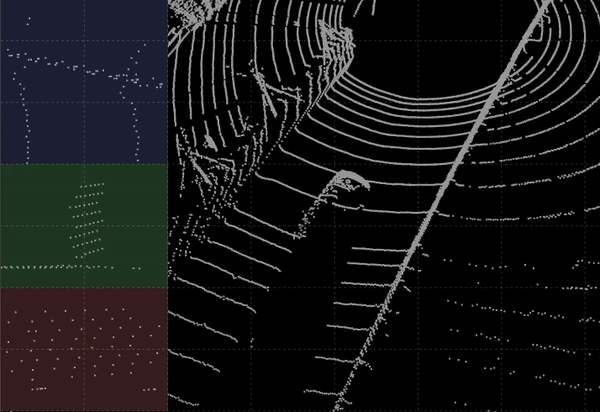
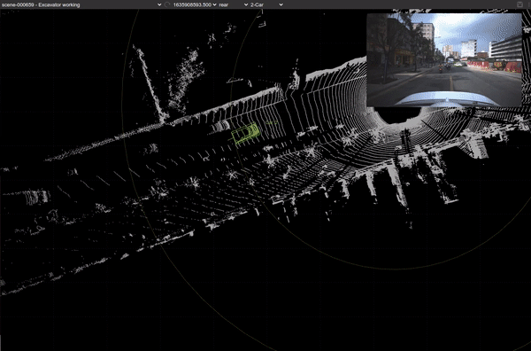

# SUSTechPOINTS: Point Cloud 3D Bounding Box Annotation Tool For Autonomous Driving

### Main UI


### Automatic yaw angle (z-axis) prediction.


### batch-mode box editing

semi-auto-annotation



## Features

- 9 DoF box editing
- Object type/ID/attributes editing
- Interactive/auto box fitting
- Batch-mode editing
- perspective/projective view editing
- Multiple camera images, with auto-camera-switching
- Binary/pcd files for point cloud data
- Jpg/png image files
- Objects/boxes/points coloring
- Focus mode to hide background to check details easily
- Stream play/stop
- Object ID generation


## Get started

[Docker](./doc/docker.md) (`docker compose up -d --build`)

[Install from source](./doc/install_from_source.md)

[uwsgi](./doc/deploy_server.md)

## Operations
[Operations](./doc/operations.md)

[Shortcuts(中文)](./doc/shortcuts_cn.md)

## Coordinate frames

- Single-lidar scenes: point clouds keep the raw sensor frame (e.g. `lidar_top`); 3D boxes and camera
  extrinsics use the same frame.
- Multi-lidar fusion scenes (`lidar_fusion.enabled`): `lidar_front`, `lidar_rear` and `lidar_top` are fused
  into the **`base_link`** frame. Fused point clouds, 3D box labels and camera extrinsics all use `base_link`.
- Fused cache files are stored as `temp/fused_lidar/<scene>/<frame>_base_link.bin`; the `base_link` suffix marks
  the cache as a `base_link`-frame fusion result.
- Sensor-to-`base_link` transforms come from `transforms/calib.json` (`tf2base_link`).

## Cite

If you find this work useful in your research, please consider cite:
```
@INPROCEEDINGS{9304562,
  author={Li, E and Wang, Shuaijun and Li, Chengyang and Li, Dachuan and Wu, Xiangbin and Hao, Qi},
  booktitle={2020 IEEE Intelligent Vehicles Symposium (IV)}, 
  title={SUSTech POINTS: A Portable 3D Point Cloud Interactive Annotation Platform System}, 
  year={2020},
  volume={},
  number={},
  pages={1108-1115},
  doi={10.1109/IV47402.2020.9304562}}
  
```
